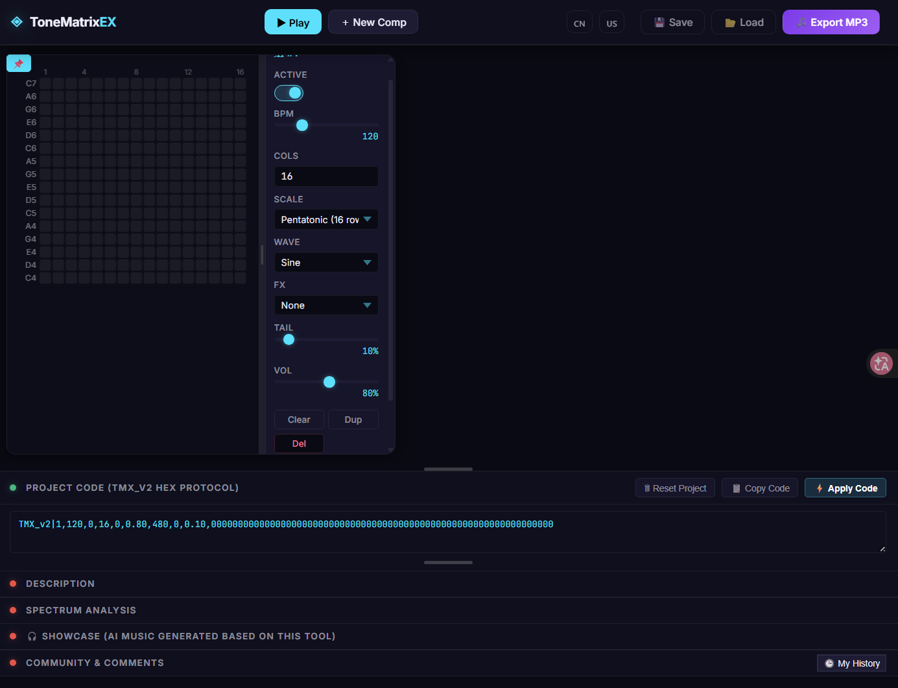

# ToneMatrixEX 🎶

<div align="center">
  
</div>

> 一个受 André Michelle 的 **ToneMatrix** 启发的 Web Grid Sequencer。
> 既可以随手玩旋律，也可以作为 Suno、Udio 等 AI 音乐工具的 Motif Generator。

---

## 关于项目

ToneMatrixEX 最初只是想复刻 ToneMatrix 那种「点几下就能听到旋律」的乐趣，但后来慢慢演变成了一个更适合现代 AI 音乐创作的小工具。

很多时候，直接给 AI 输入 Prompt，旋律和节奏都会比较随机。如果先用 ToneMatrixEX 快速画出一个简单的 Motif，再导出音频作为参考输入，就能给 AI 一个更明确的节奏和旋律方向。

它不是 DAW，也不是专业编曲软件，而是一个适合快速记录灵感、生成旋律种子的工具。

> 本项目部分代码在 Gemini 的辅助下完成。

---

## 功能

* 🎵 基于 **Tone.js**，拥有稳定的音频调度和多种合成器音色
* 💾 内置 **MP3 导出**（lamejs），方便直接用于 AI 工作流
* 💬 集成 **Waline 评论系统**，方便交流和分享作品
* ⚡ 使用 **Vite + TypeScript** 构建，开发体验简单流畅

---

## 一个比较有趣的玩法

我自己比较常用的一种工作流：

```
ToneMatrixEX
        │
        ├── 画一个简单 Motif
        │
        ├── 导出 MP3
        │
        ▼
Suno / Udio
        │
        ▼
AI 扩展完整编曲
```

很多时候，一个只有几秒钟的旋律，就足够成为整首歌的起点。

不同的 Prompt 会把同一个 Motif 演变成完全不同的风格，例如：

* EDM / Future Bass
* Kawaii Bass
* Lo-fi Hip Hop
* Cinematic Horror
* Epic Orchestral
* Synthwave
* Ambient

虽然底层旋律相同，但 AI 往往会给出截然不同的编曲和氛围。

---

## 本地开发

安装依赖：

```bash
npm install
```

启动开发服务器：

```bash
npm run dev
```

构建生产版本：

```bash
npm run build
```

---

## 技术栈

* Vite
* TypeScript
* Tone.js
* lamejs
* Waline

---

## License

本项目采用 **GPL-3.0** 协议开源。

你可以自由使用、修改和分发本项目，但任何基于本项目修改后的版本，同样需要以 GPL 协议开源。